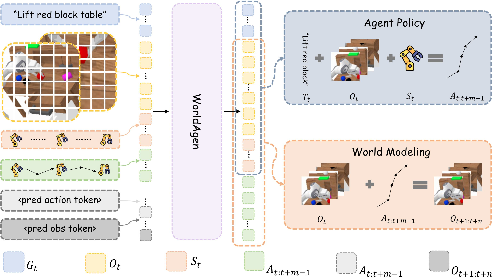

   
  
# WorldAgen: Unified State-Action Prediction with Test-Time World Model Training

## 🔥 Key Contributions

- **Unified World Model + Action Prediction Framework**  
  WorldAgen introduces a Transformer-based architecture that jointly learns **state (world dynamics)** and **action policies**, enabling tighter coupling between environment understanding and decision-making.

- **Test-Time World Model Training**  
  WorldAgen performs **lightweight online adaptation at inference time** by collecting state transitions and updating the world model, improving robustness to unseen environments.

- **Improved Generalization via Adaptive World Modeling**  
  By refining its internal world model during deployment, the method significantly enhances performance on challenging benchmarks, surpassing strong baselines with only a small number of test-time updates.

## 🚀 Getting Started 

We provide step-by-step guides to set up and run **WorldAgen** on two popular simulation benchmarks:

- **[CALVIN](docs/CALVIN.md)**  
  Setup, training, and evaluation instructions.

- **[LIBERO](docs/LIBERO.md)**  
  Setup, training, and evaluation instructions.

## 📊 Experimental Results

### 🔹 CALVIN

| Method             | Task 1 | Task 2 | Task 3 | Task 4 | Task 5 | Mean (%) |
|--------------------|--------|--------|--------|--------|--------|----------|
| **WorldAgen**      | 96.3   | 87.7   | 76.8   | 67.3   | 59.1   | 3.87     |
| **WorldAgen-TTT**  | **96.6** | **88.5** | **78.5** | **68.7** | **60.5** | **3.93** |
---
### 🔹 LIBERO-10

| Method             | Success Rate (%) |
|--------------------|-----------------|
| **WorldAgen**      | 75.5            |
| **WorldAgen-TTT**  | **79.0**        |

**WorldAgen-TTT** consistently improves performance across all tasks, demonstrating the effectiveness of test-time world model adaptation.

## Visualization

Below, we present a qualitative comparison of **WorldAgen** before and after applying test-time training (TTT) on CALVIN. As shown in the visualization, after adapting the world model, the agent performs more precise grasping and exhibits persistent retry behavior when facing failures.

<table>
  <tr>
    <td align="center">
       
      <b>Before TTT</b>
    </td>
    <td align="center">
       
      <b>After TTT</b>
    </td>
  </tr>
</table>

## Acknowledgment 
This project builds upon [Seer](https://github.com/InternRobotics/Seer/tree/main). We thank them for their open-source contributions.